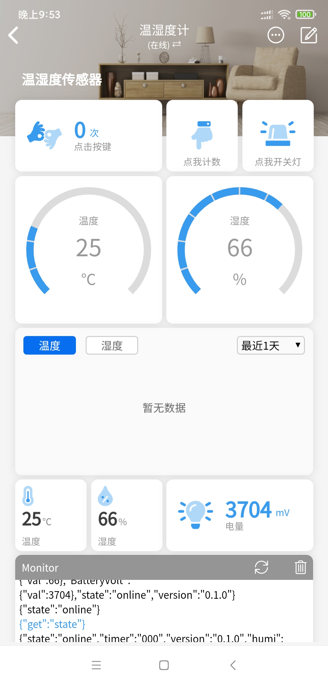

## 说明

### 1 硬件信息

ESP8266+DHT11

产品官网光和未来：http://www.nafuture.cn/newnet/al.html

 [隔壁论坛老王电子数码](https://shop154838422.taobao.com/?spm=a1z10.1-c.0.0.13275d23ylAfRX)二手淘宝链接：https://item.taobao.com/item.htm?id=625111319838&price=4.9&sourceType=item&sourceType=item&suid=d1d2ac3b-1c78-4bcd-97e0-6bbc1cff1936&shareUniqueId=3390089642&ut_sk=1.XqpPAaymHSkDALudhOi1gv3z_21646297_1600003348163.TaoPassword-QQ.1&un=171e89c074dd66d50d92f5aa52e6dceb&share_crt_v=1&spm=a2159r.13376460.0.0&sp_tk=RUJKVmNWS1pBMHo=&cpp=1&shareurl=true&short_name=h.VxzZS0q&bxsign=scd16000038058075be83c1fc24c4382b84c9f37bff07a7f&app=chrome

> usb接口已经引出io0对应USB的ID，tx，rx对应usb的d+d-。gpio12为led。gpio4是dht传感器。（摘自评论）

老王店铺买的目前测试的APP已无法正常查询温湿度（尚不知原因），故进行二次开发。

可根据评论使用otg转接线进行程序烧录，无需拆机。


### 2 开发环境

**平台：**

Arduino平台（VSCode+arduino）

**所需库：**

blinker点灯科技：https://www.diandeng.tech/home

Adafruit_Sensor DHT库

### 3 功能说明与开发计划

目前仅实现了使用 ***点灯科技*** 平台获取温湿度信息与电量的简单功能，2秒采集一次，板载LED未处理，功耗较大，且配网信息直接写在程序中。。

目前使用点灯科技Demo，后续考虑自己搭建mqtt服务器（挖坑）

- [x] 获取温湿度信息

- [x] 获取电量

- [ ] 低功耗模式

- [ ] 一键配网

  随缘更新。

目前源代码基于点灯科技Demo微改动，详情请参照官网教程。

### 4 使用说明

1.在点灯科技官网注册账号并下载APP，按照教程添加设备。

2.程序中修改 `Your Device Secret Key`、`Your WiFi network SSID or name`、`Your WiFi network WPA password or WEP key`。

3.编译程序，烧录。

4.配置显示项（温度、湿度、电量）。



5.设置触发器（配置小爱同学用）。

```js
[
	{
		"source":"switch",
		"source_zh":"开关状态",
		"state":["on","off"],
		"state_zh":["开启","关闭"]
	},
	{
		"source":"temp",
		"source_zh":"温度",
		"range":[-20,50],
		"unit":"℃"
	},
	{
		"source":"humi",
		"source_zh":"湿度",
		"range":[0,100],
		"unit":"%"
	},
	{
		"source":"BatteryVolt",
		"source_zh":"电压",
		"range":[0,5000],
		"unit":"mV"
	}
]
```


详细教程参见官网：https://www.diandeng.tech/doc/temperature-and-humidity-sensor

### 5 版权

硬件设计归光和未来所有。

软件平台归点灯科技所有。

部分介绍与创意引用自商品评论，非完全原创。

禁止商用，此Demo仅供参考。